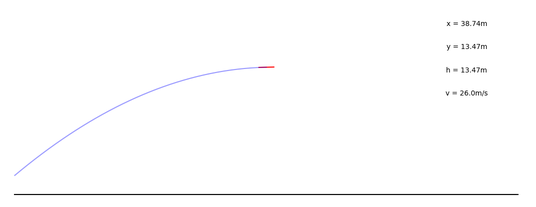
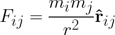
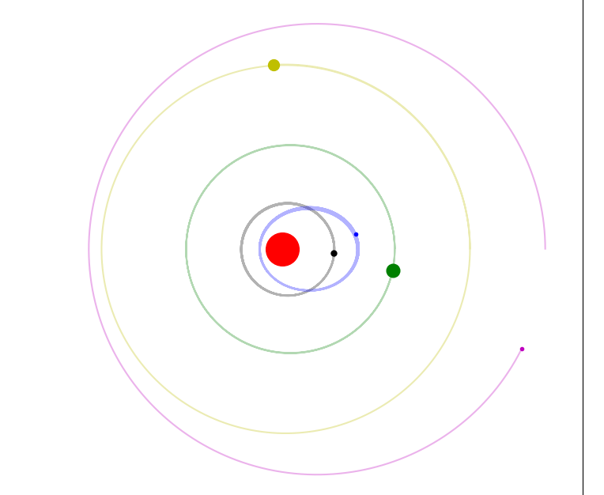
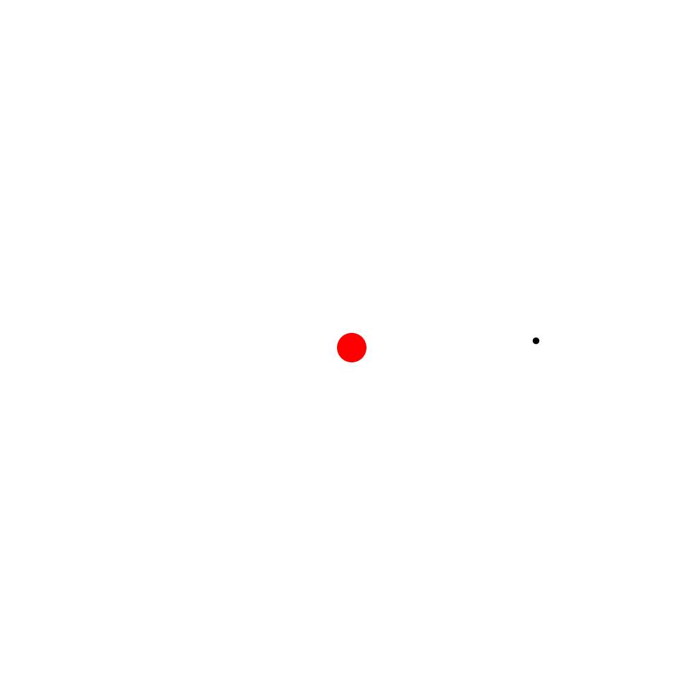
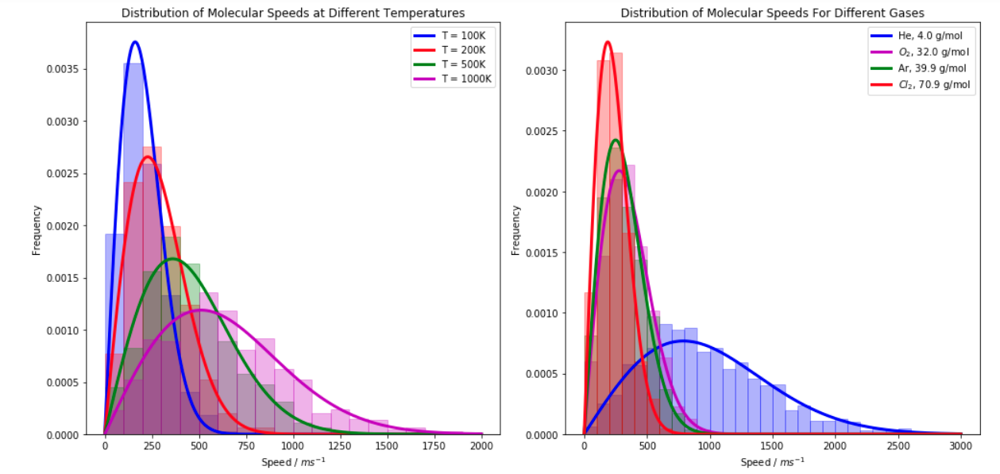
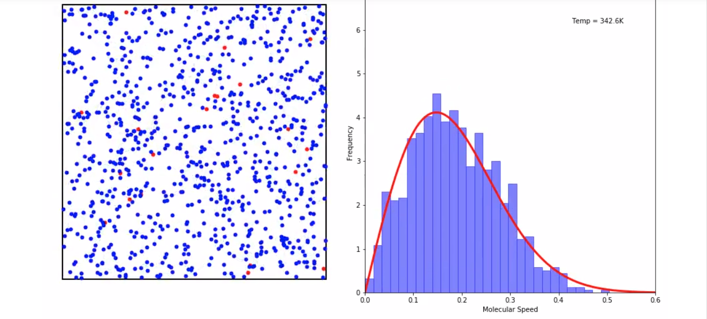
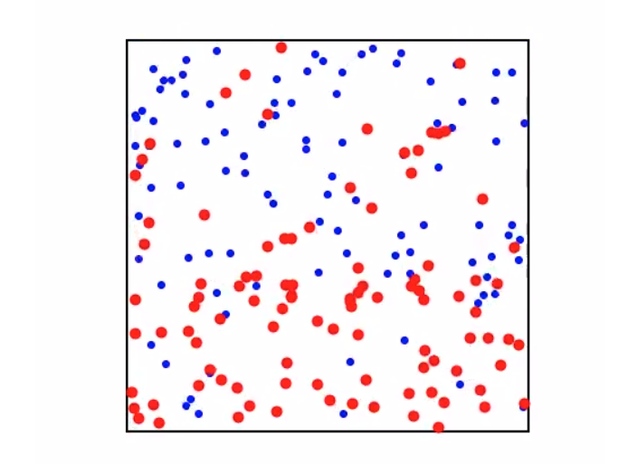
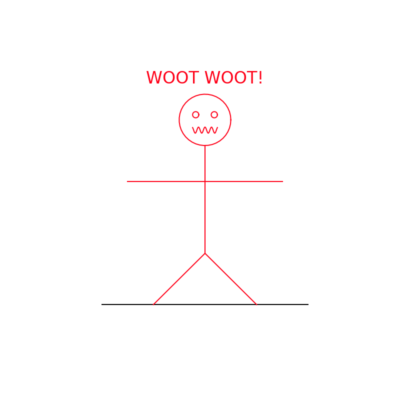

# Some Physical (and Unphysical) Simulations

This repository is a collection of simulations and animations in a couple of domains.
Most of them sprang out out of a desire to gain a more practical understanding of
how physical systems can be simulated in silico, which I felt would better ground
my research in computational chemistry. Though the systems presented here are incredibly
simple compared to any of the ones I research, I think the exercises contained
here were fruitful and very fun.

## Acknowledgements
The **gases** simulations are derived from code written by Jake Vanderplas
(email: vanderplas@astro.washington.edu). Specifically, the `balls_in_box.py` file
contains the original **ParticleBox** class (modified only to remove gravity) from
Jake's [animation tutorial](https://jakevdp.github.io/blog/2012/08/18/matplotlib-animation-tutorial/)
as well as the same basic animation code for the box itself. Calculation of the [speed
distribution](#the-maxwell-boltzmann-distribution) and animation of the histogram was added.
Jake's original BSD License statement has been left at the top of the `balls_in_box.py`
file.  

I owe the idea for plotting the the [M-B distribution](#gases)
as a histogram under the ParticleBox simulation to this [gif](https://en.wikipedia.org/wiki/Maxwell%E2%80%93Boltzmann_distribution#/media/File:Simulation_of_gas_for_relaxation_demonstration.gif)
on Wikipedia created by user Dswartz4 and licensed under the Creative Commons BY-SA 4.0
license. Why did I want to repeat what was already available? I took the goal of
re-creating the figure as a useful exercise, and I also wanted to have code that
I could then re-use for similar problems.

## Installation
I would recommend setting up a virtual environment for running these scripts
and notebooks. I have tested this code using python 3.7, but it will *probably*
work with 3.5 or newer. The dependencies are minimal--Numpy, Matplotlib, Jupyter
(if you want to run any of the notebooks), and ffmpeg (to save your animations).
Here are two options for getting this all installed.

**1. Using virtualenv and pip**
I have frozen my working environment in [full_env.txt](full_env.txt), so the environment
can be recreated with

```pip install -r full_env.txt```

in your virtualenv to get the necessary dependencies. The weird name for the requirements
is to avoid conflicts with building the environment on [Binder](#binder) when sharing notebooks.
In order to display animations in the notebook, however, you will also need to
make sure that [ffmpeg](https://ffmpeg.org/download.html) is installed on your machine.

**2. Using conda**  
Alternatively, `environment.yml` can be used to create a conda environment that includes
ffmpeg. This is the environment used for sharing the contained notebooks on [Binder](#binder).
If you are a conda user, then, just run

```conda env create -f environment.yml```

## Binder
If you want to run the notebooks in this repository but don't want to install anything
on your own computer, you can explore the [repository](#) on Binder. Binder builds a
Docker container containing a conda environment with all of the project dependencies
and allows you to run and change any of the notebooks in the repo interactively
in your browser!

Currently, only the [gas simulations](#gases) are included as a notebook and available on
Binder. In the future, it may be possible to make all of the code available in
this way.

## Organization
The repository groups the simulations roughly by topic into sub-directories of the
**dynamics** directory. Each topic sub-directory contains all of the code needed for
the sims but videos of the sims are then grouped together in the **videos**
directory within the project root to make them easier to find.

### Gravity
These simulations involve integration on Newton's equations of motion within an
inverse r potential between bodies.

* `projectile.py` : Classic projectile motion from your high school physics course,
  but with the curvature of the ground accounted for. Drag is ignored. This was
  inspired by my love of the javelin, as can be inferred by the shape of the projectile.
  When I get some free time, I would love to add in drag and the pitch moment of the
  javelin--for another time I suppose.

  - [x] 2-D planar projectile motion for point mass
  - [x] include surface curvature
  - [x] change gravity and surface curvature (how far would it fly on the moon!?)
  - [ ] drag
  - [ ] more complex projectile geometries

  To play around with the sim, tweak the last few lines of the script.

  ```python
  if __name__ == "__main__":
      h0 = 2                   # the initial height above the ground (m)
      v0 = np.array([26, 15])  # initial velocity as vx, vy

      # rg is the radius (m) of the surface the projectile is launched from - Earth's radius here
      # g - m/s - 9.8 for Earth
      # dt, nmax - time step (s), maximum number of time steps
      jav = Projectile(h0, v0, rg=6.731e6, g=9.8, dt=0.05, nmax=30000)
  ```
  Then just run it from your terminal with `python projectile.py` You should get
  a pop-up video that looks something like this!
  

* `many_planet.py` : A many body problem where planets are initialized with positions,
velocities, and weights, and the system is allowed to evolve. The units are really
dummy units, and in the inverse r potential, G is set to 1, giving the force acting
on body i by body j as
<p align="center">
  
</p>
The G term is included at the top of the file, though, and you are welcome to change
it and all of the masses and times you would like to simulate to your choice of
units. The mechanics should be the same, and I found it simpler to just focus on
the relative sizes of the bodies.

  - [x] 2-D multi-body interactions
  - [x] inverse r potential
  - [x] arbitrary initial conditions

  To set up a simulation, alter the contents of the **Initial State** block of code
  Below, we define 6 bodies in the array `initial`. Each row in the array is a body,
  and the columns are `rx, ry, vx, vy`. We specify the mass of each body in the `ms`
  array in arbitrary units, and control the look of the bodies in our plot with the
  `sizes` (marker size) and `colors` lists
  ```python
  # Initial State
  initial = np.array([[0, 0, 0, 0],
                      [7, 0, 0, 25],
                      [10, 0, 0, 15],
                      [15, 0, 0, 17.5],
                      [25, 0, 0, 14],
                      [35, 0, 0, 11]])
  ms = np.array([5000, 0.2, 0.1, 1, 0.4, 0.1])
  sizes = [30, 5, 3, 12, 10, 3]
  colors = ['r', 'k', 'b', 'g', 'y', 'm']
  ```
  This particular setup should yield something like
  

  But we can easily tweak the starting conditions to end up with some pretty cool
  phenomena, like these two massive bodies "orbiting each other"

  

  > :information_source: You may need to change the plot axes and time step to make your simulation
  run and animate smoothly. Look for the following lines to change

  ```python
  # Plotting Stuff
  dt = 1 / 120    # simulation timestep

  # Plot Stuff
  # set up figure and animation
  fig = plt.figure(figsize=(10,10))
  ax1 = fig.add_subplot(111, aspect='equal', autoscale_on=False,
                        xlim=(-40, 40), ylim=(-40, 40))  
  ```

  The animations do seem to slow a bit with time, but this doesn't seem to be too
  big of an issue for just a few bodies!

* `gravity_1body.ipynb` : This is a very short notebook for playing around with
the simplest 1 body case and makes it easier to get familiar with the code. You can play
around with initial conditions for a single "planet" orbiting the "sun", and the
plot will display the orbit, colored according to the time elapsed.

### Gases
These simulations came about while I was teaching tutorials for first-year chemistry
at the University of Victoria about ideal gases and the Kinetic Molecular Theory of
Gases. As mentioned [above](#acknowledgements), the ideas for these simulations are
nothing new, and I borrowed code for the ParticleBox class.

Everything is contained in `Gas_Sims.ipynb`. You can explore it by running

```bash
jupyter notebook
```

and then clicking on the notebook in the navigator that appears in your browser, so
long as you have your environment configured as described [above](#installation).

This notebook covers Kinetic Molecular Theory of Gases. It includes plots of the
Maxwell-Boltzmann distribution for different temperatures and particle masses:



In addition, it has a simulation of particles in a 2D box with the associated
speed distribution



and a diffusion simulation for gases with different masses



### Random

Here I have a silly animation that isn't really a simulation at all. It does,
however, involve some time evolution of traveling and stationary waves, so I
have included it here.  I call him *Animan*!!!



To run animan for yourself, just run

```bash
python animan.py
```
 in your terminal. Have fun making him do new dances by tweaking the code, too!
